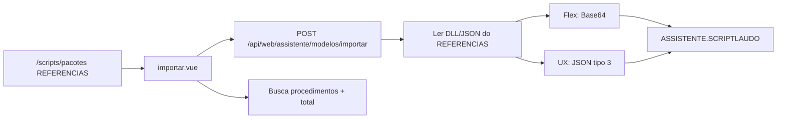

# Plano de execução: ajustes da rota `/assistente/`

Documento para outro agente implementar as mudanças sem depender do contexto da conversa anterior.

**Repositório:** `C:\Users\Nayha\Documents\Conteudos\Conteudos_migracao`

**Ordem obrigatória:** 1 → 1.1 → 2 → 3 (cada item depende parcialmente do anterior).

---

## Contexto técnico

### Bancos de dados

| Banco | Uso | Conexão |
|-------|-----|---------|
| **REFERENCIAS** | Scripts/pacotes em `/scripts/pacotes`, login web | `Firebird` em `appsettings.json` / `.env` (`FIREBIRD_DB`) |
| **ASSISTENTE** | Domínios `/assistente/*` (SCRIPTLAUDO, FRASE, PROCEDIMENTO, etc.) | `AssistantFirebird` / `ASSISTENTE_FIREBIRD_*` |

**Caminhos locais (Windows):**
- `.env` e `appsettings.Development.local.json` devem apontar para:
  - `C:/Users/Nayha/Documents/Conteudos/Conteudos_migracao/BD/REFERENCIAS.FDB`
  - `C:/Users/Nayha/Documents/Conteudos/Conteudos_migracao/BD/ASSISTENTE.FDB`
- **Não usar** caminho `OneDrive/Documentos/...` (arquivo inexistente após migração).

**Portas Firebird:**
- REFERENCIAS: `3052`
- ASSISTENTE: `3050` (erro comum: `Unable to complete network request to host 127.0.0.1` = serviço Firebird da porta 3050 parado)

### Referência de encoding Base64 (outro backend)

Arquivo na raiz do repo (se existir): **`METODOS PARA SALVAR SCRIPT EM BASE64.txt`**

Usar o **mesmo algoritmo** ao gravar `SCRIPTLAUDO.ESTRUTURASCRIPT` no banco Assistente para Laudos Flex (tipos 1 e 2).

---

## Arquivos principais (mapa)

### Frontend (Nuxt)

| Arquivo | Responsabilidade |
|---------|------------------|
| `frontend/nuxt-app/pages/assistente/index.vue` | Visão geral, botão "Importar modelo de laudo" |
| `frontend/nuxt-app/pages/assistente/modelos/importar.vue` | Formulário de importação |
| `frontend/nuxt-app/pages/assistente/procedimentos.vue` | CRUD procedimentos |
| `frontend/nuxt-app/pages/assistente/frases.vue` | CRUD frases |
| `frontend/nuxt-app/pages/assistente/scripts.vue` | Listagem scripts |
| `frontend/nuxt-app/composables/useAssistenteApi.ts` | API assistente, `importModel`, `options()`, `domainFields` |
| `frontend/nuxt-app/composables/useScriptsApi.ts` | API scripts/pacotes (REFERENCIAS) |
| `frontend/nuxt-app/components/assistente/AssistenteDomainCrud.vue` | CRUD genérico |
| `frontend/nuxt-app/components/assistente/AssistenteNav.vue` | Navegação |

### Backend (.NET)

| Arquivo | Responsabilidade |
|---------|------------------|
| `backend/MdwConteudos.Api/Modules/Assistente/Importacao/AssistenteImportacaoService.cs` | Importar modelo → SCRIPTLAUDO + vínculos |
| `backend/MdwConteudos.Api/Modules/Assistente/Importacao/AssistenteImportacaoContracts.cs` | DTOs do import |
| `backend/MdwConteudos.Api/Modules/Assistente/Dominios/AssistenteDominiosService.cs` | List/Get/Create/Update domínios |
| `backend/MdwConteudos.Api/Modules/Assistente/Dominios/AssistenteDominiosController.cs` | `GET/POST /api/web/assistente/{domain}` |
| `backend/MdwConteudos.Api/Modules/Assistente/Vinculos/AssistenteVinculosService.cs` | Vínculos script↔especialidade, etc. |
| `backend/MdwConteudos.Api/Infrastructure/AssistantFirebirdConnectionFactory.cs` | Conexão Assistente |

### Scripts REFERENCIAS (origem dos modelos)

Explorar módulo de scripts web em `backend/MdwConteudos.Api/Modules/` (Scripts, Web) e rotas usadas por `/scripts/pacotes` no frontend.

---

## Item 1 — Importar modelo a partir de `/scripts/pacotes`

### Objetivo

Substituir upload de DLL na tela "Importar modelo de laudo" por **seleção de um script/modelo já cadastrado** em `/scripts/pacotes` (banco REFERENCIAS). Copiar para `SCRIPTLAUDO` no Assistente com encoding correto.

### Regras de negócio

| Origem | TIPOSCRIPT | ESTRUTURASCRIPT no Assistente |
|--------|------------|-------------------------------|
| **Laudos Flex** (VB legado) | `1` | DLL do REFERENCIAS (blob binário) → **Base64** (string) |
| **Laudos Flex** (C#) | `2` | Idem: blob → **Base64** |
| **Laudos UX** | `3` | Estrutura em **JSON** (texto), `TIPOSCRIPT = 3` |

**Decisão do usuário:** origem = **pick_existing** (selecionar pacote/script existente, não upload).

### Estado atual (esperado)

- `importar.vue` envia `FormData` com `arquivoScript`, `arquivoMrd`, `tituloScript`, `tipoScript`, `especialidades[]`, `procedimentos[]`.
- `useAssistenteApi.importModel()` → `POST /api/web/assistente/modelos/importar`.
- `AssistenteImportacaoService` grava conteúdo do arquivo diretamente (não Base64 para Flex).

### Implementação sugerida

#### 1.1 Frontend — `importar.vue`

1. Remover inputs de upload de DLL (ou torná-los opcionais apenas para MRD se ainda necessário).
2. Adicionar seletor de script de origem:
   - Listar scripts/pacotes via `useScriptsApi` (mesma fonte de `/scripts/pacotes`).
   - Campos mínimos: `codScriptLaudo`, nome, tipo/sistema (Flex vs UX).
3. Ao selecionar script:
   - Preencher `tituloScript` e inferir `tipoScript` (1/2/3) conforme metadados do script REFERENCIAS.
   - Para UX, garantir tipo 3.
4. Payload de importação: enviar `codScriptLaudoOrigem` (e `codVersao` se aplicável) em vez de `arquivoScript`.

#### 1.2 Frontend — `useAssistenteApi.ts`

Atualizar `ImportarModeloPayload` e `importModel()`:

```ts
// Depois (sugerido)
export interface ImportarModeloPayload {
  codScriptLaudoOrigem: number
  codVersaoOrigem?: number
  tituloScript?: string
  tituloMrd?: string
  arquivoMrd?: File
  especialidades: number[]
  procedimentos: number[]
}
```

Enviar JSON (`api.post`) ou FormData híbrido se MRD ainda for arquivo.

#### 1.3 Backend — contracts

Em `AssistenteImportacaoContracts.cs`, substituir/estender request:

- `CodScriptLaudoOrigem` (int, obrigatório)
- `CodVersaoOrigem` (int?, opcional)
- Manter listas `Especialidades`, `Procedimentos`
- MRD: validar se continua obrigatório no fluxo atual

#### 1.4 Backend — service

Em `AssistenteImportacaoService.cs`:

1. **Ler script no REFERENCIAS** (injetar `IFirebirdConnectionFactory` ou serviço de scripts existente).
2. Obter blob/estrutura da versão ativa (tabelas típicas: `SCRIPTLAUDO`, `SCRIPTLAUDOVERSAO` — confirmar no código de `/scripts`).
3. **Flex (tipo 1 ou 2):**
   - Ler bytes binários da DLL.
   - Converter com `Convert.ToBase64String(bytes)`.
   - Gravar string Base64 em `ESTRUTURASCRIPT`.
4. **UX (tipo 3):**
   - Ler estrutura JSON (campo texto ou deserializar conforme REFERENCIAS).
   - Gravar JSON em `ESTRUTURASCRIPT`.
   - Forçar `TIPOSCRIPT = 3` no INSERT.
5. Inserir em `SCRIPTLAUDO` (Assistente) + vínculos especialidade/procedimento (lógica existente).
6. Se houver import de MRD/PAGFOTOS, manter comportamento atual.

#### 1.5 Helper Base64

Criar classe utilitária espelhando `METODOS PARA SALVAR SCRIPT EM BASE64.txt`:

`backend/MdwConteudos.Api/Modules/Assistente/Importacao/AssistenteScriptEncoding.cs`

```csharp
public static class AssistenteScriptEncoding
{
    public static string ToBase64Structure(byte[] dllBytes) =>
        Convert.ToBase64String(dllBytes);
}
```

Ajustar se o arquivo `.txt` usar prefixo, charset ou quebras de linha específicas.

### Critérios de aceite — Item 1

- [ ] Tela de importação lista scripts de `/scripts/pacotes`.
- [ ] Importar Flex grava Base64 em `ESTRUTURASCRIPT` no Assistente.
- [ ] Importar UX grava JSON e `TIPOSCRIPT = 3`.
- [ ] Vínculos especialidade/procedimento continuam funcionando.
- [ ] Sem regressão no login/API assistente (Firebird 3050 ativo).

---

## Item 1.1 — Procedimentos: busca e total

### Problema

`useAssistenteApi.options()` chama `list(domain, 1, 100, search)` → **máximo 100 procedimentos**, sem busca útil na UI de importação.

### Implementação

#### Frontend — `importar.vue`

1. Substituir `<select>` múltiplo de procedimentos por componente com:
   - Campo de **busca** (debounce ~300ms).
   - Chamada `assistenteApi.list('procedimentos', page, pageSize, searchTerm)`.
   - `pageSize` maior (ex.: 50) com paginação ou scroll infinito.
2. Exibir texto: **"X procedimentos cadastrados"** usando `total` da resposta.
3. Opcional: mesmo padrão para especialidades se lista também estiver limitada.

#### Backend (se necessário)

Verificar `AssistenteDominiosService.List` para domínio `procedimentos`:

- Garantir que `search` filtra por descrição/código TUSS.
- Garantir que `total` reflete count real (não só `items.Count`).

### Critérios de aceite — Item 1.1

- [ ] Busca por nome/código TUSS funciona.
- [ ] Total de procedimentos visível na tela.
- [ ] Usuário consegue encontrar procedimentos além dos primeiros 100.

---

## Item 2 — Frases: editar em texto, persistir RTF `ansicpg1252`

### Problema

Ao editar frase, campo **conteúdo** exibe RTF bruto. Usuário quer editar **texto simples**; ao salvar, gravar RTF compatível com backend legado (`\rtf1\ansi\ansicpg1252`).

### Implementação

#### 2.1 Backend (preferencial)

Em `AssistenteDominiosService` (domínio `frases`):

**GET (Get / List para edição):**

- Se campo `FRASE` começa com `{\rtf`, converter RTF → texto plano antes de retornar ao frontend.
- Adicionar flag ou campo derivado `conteudoTexto` na resposta (ou substituir `frase` na API web apenas).

**PUT/POST (Update/Create):**

- Receber texto plano do frontend.
- Converter texto → RTF mínimo:

  ```
  {\rtf1\ansi\ansicpg1252\deff0{\fonttbl{\f0\fswiss Arial;}}\viewkind4\uc1\pard\f0\fs20 <texto escapado>\par}
  ```

- Escapar `\`, `{`, `}`, quebras de linha → `\par`.
- Codificar caracteres não-ASCII como `\'XX` em **Windows-1252** (code page 1252).

Criar helper:

`backend/MdwConteudos.Api/Modules/Assistente/Core/RtfAnsiHelper.cs`

Métodos sugeridos:

- `string ToPlainText(string rtf)`
- `string FromPlainText(string text)` com header `ansicpg1252`

#### 2.2 Frontend

Em `frases.vue` / `AssistenteDomainCrud`:

- Campo `conteudo`/`frase` como textarea de texto simples.
- Não exibir RTF cru ao usuário.

#### 2.3 Validação

1. Abrir frase existente no banco → editor mostra texto legível.
2. Salvar alteração → banco contém RTF com `ansicpg1252`.
3. Backend legado (outro sistema) continua interpretando a frase.

### Critérios de aceite — Item 2

- [ ] Edição mostra texto, não RTF.
- [ ] Salvamento gera RTF `ansicpg1252`.
- [ ] Frases existentes não corrompem após editar e salvar.

---

## Item 3 — Aba Scripts

### 3.0 Remover botão "Novo"

Arquivo: `frontend/nuxt-app/pages/assistente/scripts.vue` e/ou `AssistenteDomainCrud.vue`.

- Adicionar prop `hideCreate?: boolean` no CRUD.
- Em `scripts.vue`: `:hide-create="true"`.
- Scripts só entram via importação (Item 1).

### 3.1 Coluna Especialidade

**Problema:** coluna vazia — listagem não traz especialidade vinculada.

**Backend** — `AssistenteDominiosService`, query de `scripts`:

- JOIN com tabela de vínculo script↔especialidade (ver `AssistenteVinculosService`).
- Retornar campo `ESPECIALIDADE` ou `DESCRICAO` da especialidade na listagem.

**Frontend** — `useAssistenteApi.ts` `domainFields.scripts`:

```ts
scripts: {
  // ... existentes
  especialidade: 'ESPECIALIDADE',
}
```

**Frontend** — `scripts.vue` colunas:

```ts
{ key: 'especialidade', label: 'Especialidade' }
```

### 3.2 Coluna Tipo — rótulos

Mapear `TIPOSCRIPT` / `tipoScript`:

| Valor | Label |
|-------|-------|
| 1 | VB (legado) |
| 2 | C# |
| 3 | JSON |

Implementar formatter no CRUD ou coluna custom:

```ts
function formatTipoScript(value: number) {
  const map: Record<number, string> = { 1: 'VB (legado)', 2: 'C#', 3: 'JSON' }
  return map[value] ?? String(value)
}
```

### Critérios de aceite — Item 3

- [ ] Botão "Novo" ausente em `/assistente/scripts`.
- [ ] Coluna Especialidade preenchida quando houver vínculo.
- [ ] Coluna Tipo mostra VB (legado) / C# / JSON, não 1/2/3.

---

## Fluxo de dados (importação)



---

## Checklist de verificação manual

1. **Firebird Assistente** rodando na porta **3050**.
2. **Caminhos** em `.env` apontam para `Documents/Conteudos/.../BD/*.FDB`.
3. Reiniciar API após alterar `.env`.
4. Login web: `POST /api/web/auth/login` → 200.
5. `GET /api/web/assistente/procedimentos?page=1&pageSize=5` → 200 com `total`.
6. Importar modelo Flex → verificar `ESTRUTURASCRIPT` é Base64 válido.
7. Importar modelo UX → `TIPOSCRIPT = 3`, conteúdo JSON.
8. Editar frase → texto na UI, RTF no banco.
9. `/assistente/scripts` → sem Novo, especialidade e tipo legíveis.

---

## Ordem de commits sugerida

1. `feat(assistente): importar modelo de script existente com Base64/JSON`
2. `feat(assistente): busca e total de procedimentos na importação`
3. `feat(assistente): frases RTF ansicpg1252 na edição`
4. `fix(assistente): scripts listagem especialidade e tipo legível`

---

## Riscos e pontos de atenção

| Risco | Mitigação |
|-------|-----------|
| Firebird 3050 offline | Checar serviço antes de testar assistente |
| Algoritmo Base64 diferente do legado | Copiar exatamente de `METODOS PARA SALVAR SCRIPT EM BASE64.txt` |
| RTF quebra parser legado | Testar round-trip com frase real do banco |
| Schema REFERENCIAS desconhecido | Inspecionar `ScriptsWebService` / queries de export DLL |
| MRD ainda obrigatório no import | Manter upload MRD opcional se necessário |

---

## Comandos úteis

```powershell
# API
cd backend\MdwConteudos.Api
dotnet run

# Frontend
cd frontend\nuxt-app
npm run dev

# Teste login
Invoke-RestMethod -Uri "http://localhost:5080/api/web/auth/login" -Method POST -ContentType "application/json" -Body '{"usuario":"Lucas","senha":"lucas123"}'

# Teste procedimentos (com token)
Invoke-RestMethod -Uri "http://localhost:5080/api/web/assistente/procedimentos?page=1&pageSize=5&search=" -Headers @{ Authorization = "Bearer <token>" }
```

---

## Definição de pronto

Todos os itens 1, 1.1, 2 e 3 implementados e checklist manual passando.

**Prompt sugerido para outro agente:**

> Implemente conforme `docs/PLANO_AJUSTES_ROTA_ASSISTENTE.md`. Siga a ordem 1 → 1.1 → 2 → 3. Não edite o arquivo de plano.
