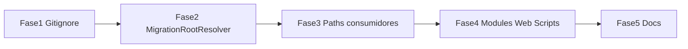

# Plano de refatoração incremental — estrutura e paths (alta prioridade)

Documento para **outro agente** executar em etapas, sem parar o desenvolvimento. Foco nas quatro recomendações de **alta prioridade** da análise de estrutura.

**Repositório:** raiz atual do checkout; o nome físico da pasta é irrelevante.

**Decisão aplicada:** manter o checkout atual e resolver a raiz pela presença de `backend/MdwConteudos.Api` e `frontend/nuxt-app`. `Conteudos_migracao` permanece apenas como nome do repositório remoto.

**Status em 07/09/2026:** implementação concluída no working tree; solução compilada com sucesso e testes automatizados aprovados. Os testes funcionais com arquivos e bancos continuam pendentes.

**Ordem obrigatória:** Fase 1 → 2 → 3 → 4 → 5 (cada fase depende da anterior).

**Fora de escopo deste plano:** fundir `ConversorHtml.*` em `Modules/`, refatorar `CadastrosControllers.cs`, criar `.sln`, rotas duplicadas no Nuxt.

---

## Objetivo

1. Eliminar dependências de código em qualquer nome físico específico para a raiz.
2. Centralizar resolução de paths (static, uploads, anexos).
3. Remover artefatos de build versionados no git.
4. Mover `WebScriptsController` + `ScriptsService` para `Modules/Web/`, alinhando ao padrão dos demais módulos.

---

## Decisão de naming (aplicar antes de codar)

| Opção | Descrição |
|-------|-----------|
| **A (adotada)** | Manter a pasta atual e resolver a raiz pelo conteúdo (`backend/`, `frontend/nuxt-app/`), sem exigir um nome específico. |
| B | Renomear fisicamente o checkout (descartada por quebrar paths locais, OneDrive e atalhos). |

Este plano assume **Opção A**.

---

## Fase 1 — Higiene do repositório (git)

**Risco:** baixo. **Esforço:** ~15 min.

### 1.1 Atualizar `.gitignore`

Adicionar na raiz:

```gitignore
# Artefatos locais de build (não versionar)
backend/MdwConteudos.Api/bin-check/
backend/MdwConteudos.Api/bin-temp/
.dotnet/
```

Atualizar o cabeçalho de “ASP.NET Core 8” para **Core 10**.

### 1.2 Remover pastas do índice git (não apagar localmente se ainda em uso)

```powershell
cd <raiz-do-checkout>
git rm -r --cached backend/MdwConteudos.Api/bin-check
git rm -r --cached backend/MdwConteudos.Api/bin-temp
```

**Atenção:** `bin-check/appsettings.Development.local.json` pode conter segredos. Confirmar que **não** será reintroduzido no commit. Se houver segredos no histórico, avisar o usuário (rotação de chaves).

### 1.3 Verificação

```powershell
git status
# bin-check/ e bin-temp/ devem aparecer como untracked ou ausentes do stage
```

**Commit sugerido:** `chore: remove artefatos de build do controle de versão`

---

## Fase 2 — Resolver raiz da migração (single source of truth)

**Risco:** médio. **Esforço:** ~1–2 h.

### 2.1 Criar helper central

**Arquivo novo:** `backend/MdwConteudos.Api/Infrastructure/MigrationRootResolver.cs`

Responsabilidades:

- `FindRepoRoot(startDir)` — sobe diretórios até achar `.env` **ou** `app.py` (legado Flask no repo pai).
- `GetMigrationRoot(startDir)` — retorna a pasta da **stack nova**:
  1. Se `startDir` ou ancestral contém `frontend/nuxt-app` **e** `backend/MdwConteudos.Api` → essa pasta.
  2. Senão, procurar ancestral ou filho imediato que possua os marcadores estruturais da stack nova.
  3. Senão, fallback atual: `Path.GetFullPath(Path.Combine(contentRoot, "..", ".."))` (sobe de `MdwConteudos.Api` para raiz `backend/..`).

Métodos auxiliares (opcional, recomendado):

```csharp
public static string StaticDir(string migrationRoot) => Path.Combine(migrationRoot, "static");
public static string StaticUploadsDir(string migrationRoot) => Path.Combine(migrationRoot, "static", "uploads");
public static string UploadsDir(string repoRoot) => Path.Combine(repoRoot, "uploads");
```

### 2.2 Refatorar `Program.cs`

Substituir funções locais `FindRepoRoot` / `GetMigrationRoot` por chamadas a `MigrationRootResolver`.

**Corrigir serve de static** (linha ~214):

```csharp
// ANTES
var migracaoStaticDir = Path.Combine(repoRoot, "mdw-migracao", "static");

// DEPOIS
var migrationRoot = MigrationRootResolver.GetMigrationRoot(app.Environment.ContentRootPath);
var migracaoStaticDir = MigrationRootResolver.StaticDir(migrationRoot);
```

Manter fallback se pasta não existir (não quebrar startup).

### 2.3 Verificação

```powershell
cd backend\MdwConteudos.Api
dotnet build
dotnet run
# GET http://localhost:5080/static/... (asset conhecido)
```

**Commit sugerido:** `refactor: centralizar MigrationRootResolver`

---

## Fase 3 — Remover nomes físicos de pasta dos consumidores

**Risco:** médio-alto (uploads/anexos). **Esforço:** ~2–3 h.

### 3.1 Arquivos C# a alterar

| Arquivo | O que mudar |
|---------|-------------|
| [`Program.cs`](../backend/MdwConteudos.Api/Program.cs) | Já na Fase 2 |
| [`Modules/Web/ScriptsService.cs`](../backend/MdwConteudos.Api/Modules/Web/ScriptsService.cs) | raiz da migração, uploads e resolução de arquivos legados |
| [`Services/ReferenciasService.cs`](../backend/MdwConteudos.Api/Services/ReferenciasService.cs) | `_staticUploadsRoot` |
| [`Modules/ApiPublica/ApiScriptOperations.cs`](../backend/MdwConteudos.Api/Modules/ApiPublica/ApiScriptOperations.cs) | candidatos de path static ~linha 370 |
| [`Modules/Web/VariaveisWebController.cs`](../backend/MdwConteudos.Api/Modules/Web/VariaveisWebController.cs) | `FindMigracaoRoot()` — substituir por `MigrationRootResolver` |

**Padrão de substituição:**

```csharp
// ANTES
Path.Combine(_repoRoot, "mdw-migracao", "static", "uploads")

// DEPOIS
MigrationRootResolver.StaticUploadsDir(migrationRoot)
```

Injetar ou resolver `migrationRoot` no construtor dos services (via `IWebHostEnvironment.ContentRootPath` ou helper estático).

### 3.2 Documentação a atualizar

| Arquivo | Ação |
|---------|------|
| [`README.md`](../README.md) | Usar paths relativos à raiz (`backend\`, `frontend\`) |
| [`CHECKLIST_MIGRACAO_NUXT4.md`](../CHECKLIST_MIGRACAO_NUXT4.md) | Idem |
| [`docs/CUTOVER.md`](CUTOVER.md) | Idem |
| [`docs/DEPLOY.md`](DEPLOY.md) | Confirmar paths de deploy |
| [`docs/azure-pipelines-migracao.example.yml`](azure-pipelines-migracao.example.yml) | Usar `backend/` e `frontend/nuxt-app` ou variável `$(Build.SourcesDirectory)` |

### 3.3 Testes manuais obrigatórios

| Fluxo | Rota / ação |
|-------|-------------|
| Static Nuxt/API | Arquivo em `static/img/logo.png` |
| Upload script | `/scripts` — criar versão com anexo |
| Referências anexos | `/referencias/[id]/anexos` |
| Variáveis anexo | complementos de variável |
| API parceiros script | endpoint que resolve arquivo em `static/` |

**Commit sugerido:** `fix: paths de static/uploads usam raiz da migração`

---

## Fase 4 — Consolidar Scripts em `Modules/Web/`

**Risco:** médio. **Esforço:** ~1–2 h.

### 4.1 Contexto atual

| Peça | Local | Papel |
|------|-------|-------|
| `WebScriptsController` | `Controllers/` | CRUD completo `/api/web/scripts` (~550 linhas) |
| `ScriptsService` | `Services/` | Lógica + uploads + e-mail |
| `ScriptsWebService` | `Modules/Web/` | Listagem simples (Assistente/outros) |

**Não fundir** `ScriptsWebService` com `ScriptsService` nesta fase — apenas **mover** arquivos e namespaces.

### 4.2 Movimentos de arquivo

```
Controllers/WebScriptsController.cs  →  Modules/Web/WebScriptsController.cs
Services/ScriptsService.cs         →  Modules/Web/ScriptsService.cs
```

### 4.3 Ajustes de namespace

```csharp
// DEPOIS
namespace MdwConteudos.Api.Modules.Web;
```

Atualizar:

- [`Program.cs`](../backend/MdwConteudos.Api/Program.cs) — remover `using MdwConteudos.Api.Services` se ficar vazio; manter `AddScoped<ScriptsService>()`.
- [`Modules/Assistente/Importacao/AssistenteImportacaoService.cs`](../backend/MdwConteudos.Api/Modules/Assistente/Importacao/AssistenteImportacaoService.cs) — `using MdwConteudos.Api.Modules.Web`.
- Qualquer outro `using MdwConteudos.Api.Services` (grep).

### 4.4 Pasta `Services/`

Após mover `ScriptsService`:

- Se **`ReferenciasService.cs`** permanecer → manter pasta `Services/` temporariamente **ou** mover na mesma PR (recomendado mover `ReferenciasService` para `Modules/Web/ReferenciasService.cs` — mesmo padrão, baixo risco).

### 4.5 Pasta `Controllers/`

Após mover `WebScriptsController`:

- Restará apenas [`ConversionsController.cs`](../backend/MdwConteudos.Api/Controllers/ConversionsController.cs) (Studio).
- **Não mover** neste plano — documentar que Studio fica em bounded context separado.

Opcional: adicionar comentário em `Controllers/ConversionsController.cs`:

```csharp
// Bounded context ConversorHtml — host HTTP fino; ver ConversorHtml.Application
```

### 4.6 Verificação

```powershell
dotnet build
dotnet test backend/ConversorHtml.Tests   # se aplicável
```

Testes manuais Nuxt:

- `/scripts` — listagem, criar, editar, versões
- `/scripts/pacotes`
- `/assistente/modelos/importar` (usa `ScriptsService`)

Swagger: rotas `/api/web/scripts/*` inalteradas.

**Commit sugerido:** `refactor: mover WebScripts para Modules/Web`

---

## Fase 5 — Documentação e encerramento

**Risco:** nulo. **Esforço:** ~30 min.

### 5.1 Atualizar [`docs/DEPLOY.md`](DEPLOY.md)

- Seção “Estrutura no servidor”: copiar `static/`, `uploads/` e `backend/agent-bridge/` sem depender do nome do checkout.
- Mencionar `MigrationRootResolver` e variável opcional `LegacyPaths:RepoRoot`.

### 5.2 Atualizar [`README.md`](../README.md)

- Diagrama de pastas usando `<raiz-do-projeto>/`.
- Link para este plano: `docs/PLANO_REFATORACAO_ESTRUTURA.md`.

### 5.3 Checklist final para o agente executor

- [ ] `grep -r "mdw-migracao"` retorna zero em `.cs` (docs podem mencionar legado uma vez como “compatibilidade”)
- [ ] `bin-check/` e `bin-temp/` fora do git
- [ ] `dotnet build` Release OK
- [ ] `npm run build` em `frontend/nuxt-app` OK
- [ ] Fluxos de upload/anexo testados
- [ ] `/api/web/scripts` responde igual ao antes
- [ ] `/studio/converter` inalterado

---

## Ordem de execução (resumo)



| Fase | Entregável | Pode fazer PR separado? |
|------|------------|-------------------------|
| 1 | `.gitignore` + remove cached artifacts | Sim |
| 2 | `MigrationRootResolver` + `Program.cs` | Sim |
| 3 | Services e docs agnósticos ao nome da raiz | Sim (depende 2) |
| 4 | Move controller/service Scripts | Sim (depende 3) |
| 5 | DEPLOY + README | Sim |

Recomendação: **1 PR por fase** para revisão incremental.

---

## Rollback

| Fase | Rollback |
|------|----------|
| 1 | Reverter commit; pastas voltam ao git se necessário |
| 2–3 | Reverter commits de path; risco de uploads em path novo — evitar deploy parcial |
| 4 | Reverter move; ASP.NET descobre controllers por assembly — namespace import deve voltar |

---

## Armadilhas conhecidas

1. **`LegacyPaths:RepoRoot`** vazio — services usam fallback `Directory.GetCurrentDirectory()`; em IIS/NSSM o cwd pode diferir. Preferir `MigrationRootResolver` + config explícita em produção.
2. **Resolução de anexos em VariaveisWebController** — deve usar o resolvedor central; falhas de detecção impedem o upload.
3. **Dois services de scripts** — `ScriptsWebService` ≠ `ScriptsService`; não renomear sem mapear consumidores.
4. **`ConversionsController`** — não mover para `Modules/` neste plano (bounded context separado).
5. **Repositório Flask pai** — a detecção estrutural da stack nova deve ocorrer antes da procura por `app.py`.

---

## Próximos passos (média prioridade — plano futuro)

- [x] Criar solução do backend (`backend/MdwConteudos.slnx`)
- Extrair controllers de `ConteudosWebService.cs` / `AgenteWebService.cs`
- Refatorar `CadastrosControllers.cs` (1 controller por arquivo)
- Renomear `ConversorHtml.Tests` → `MdwConteudos.Tests`
- Mover `METODOS PARA SALVAR SCRIPT EM BASE64.txt` para `docs/`

---

## Referências

- Análise de estrutura (conversa / agente de exploração)
- [`docs/DEPLOY.md`](DEPLOY.md) — requisitos de runtime
- [`docs/CUTOVER.md`](CUTOVER.md) — proxy e NSSM
